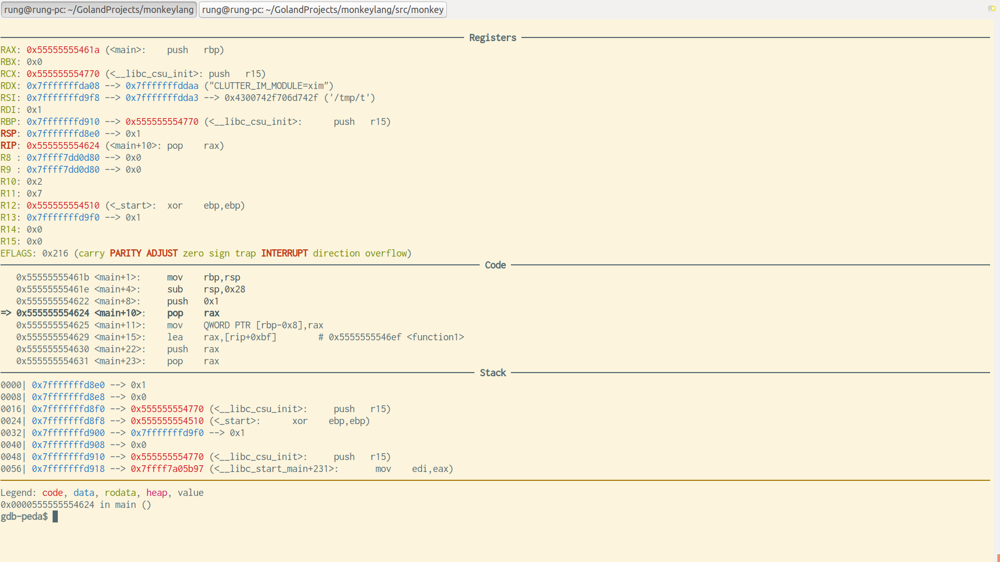

# Debugging method
- I use some famous tools for debugging.

## gdb(peda)
- https://github.com/longld/peda



## objdump
```bash
$ objdump -s -j .rodata /tmp/t

/tmp/t:     file format elf64-x86-64

Contents of section .rodata:
 07f0 01000200 64756d6d 790a0048 656c6c6f  ....dummy..Hello
 0800 20576f72 6c64210a 00                  World!..       
$ 

```

## hexdump
```bash
$ hexdump -C /tmp/t | head -5
00000000  7f 45 4c 46 02 01 01 00  00 00 00 00 00 00 00 00  |.ELF............|
00000010  03 00 3e 00 01 00 00 00  10 05 00 00 00 00 00 00  |..>.............|
00000020  40 00 00 00 00 00 00 00  90 19 00 00 00 00 00 00  |@...............|
00000030  00 00 00 00 40 00 38 00  09 00 40 00 1c 00 1b 00  |....@.8...@.....|
00000040  06 00 00 00 04 00 00 00  40 00 00 00 00 00 00 00  |........@.......|
$ 

```

## gcc
- I often generate assembly code from simple 'C' code.
  - and compare assembly codes from Monkey and C
```bash
$ cat t.c 
#include <unistd.h>

int main(void){
  syscall(1, 1, "hello world!\n", 13);
  return 0;
}

$ 
$ gcc -o0 -S -masm=intel t.c 
$ cat t.s
.intel_syntax noprefix

.text
.global main
main:
	push rbp
	mov rbp, rsp
	sub rsp, 24
	push 1
...
```
